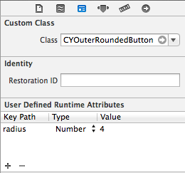

#CYOuterRoundedButton

CYOuterRoundedButton is a button with outer rounded corners, which are commonly used in web browsers. It's a subclass of `UIButton` with a custom layer mask applied.


##Usage
To use `CYOuterRoundedButton` just simply import the file and use it as the standard `UIButton`.

```objc
#import "CYOuterRoundedButton"

CYOuterRoundedButton *button = [[CYOuterRoundedButton alloc] initWithFrame:CGRectMake(40, 80,
                                                                                      100, 30)
                                                                      radius:4.0];
[self.view addSubview:button];

```

###Storyboard Support
> Thanks for EJ's suggestion.

You may also use it in a storyboard-based project, just simply set an attribute named `radius` in your storyboard settings.




###Note
You may need to set the `width` of the button as `DESIRED_WIDTH + 2*RADIUS` in order to save spaces for bottom corners.
